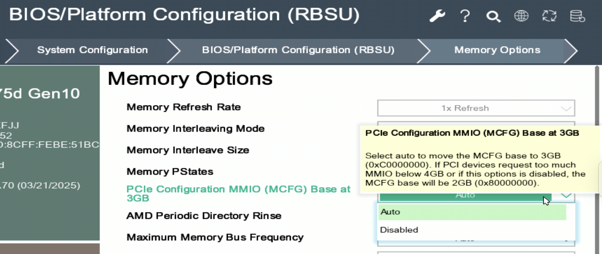

# Change node to private use
- Stop pbs client
systemctl stop pbs.service
systemctl disable pbs.service

- Stop NAS client
umount /home/users
remove nas mounting point at /etc/fstab, 
    172.16.0.22:/mnt/tank/hpcc /home/users    nfs    defaults      1 2

- Stop beegfs client - umount /mnt/beegfs: 
systemctl stop beegfs-client
systemctl disable beegfs-client

- Create admin user for group:
```
adduser -m gadm
passwd gadm
usermod -aG wheel gadm
```

## Change back from private use to pbsnode
- Stop pbs client
systemctl start pbs.service
systemctl enable pbs.service

- Stop NAS client

Add nas mounting point at /etc/fstab, 
    172.16.0.22:/mnt/tank/hpcc /home/users    nfs    defaults      1 2
Mount:
mount -a

- Stop beegfs client - umount /mnt/beegfs: 
systemctl start beegfs-client
systemctl enable beegfs-client

# Ubuntu
## Fix grub boot config
Add GRUB_CMDLINE_LINUX_DEFAULT="pci=realloc=off"

## new user
```
adduser -m gadm
usermod -aG sudo gadm
```
# Network
00-config.yaml
network:
  ethernets:
    ens19p1:
      addresses:
      - 172.16.0.32/24
      nameservers:
        addresses: [192.168.2.100, 8.8.8.8]
      routes:
      - to: default
        via: 172.16.0.15
  version: 2

00-config.yaml
# This is the network config written by 'subiquity'
network:
  ethernets:
    ens17:
      dhcp4: true
    ens19:
      dhcp4: false
      addresses:
        - 172.16.0.32/24
    ens21f0:
      dhcp4: false
      addresses:
      - 192.168.33.32/24
      routes:
      - to: default
        via: 192.168.33.1
      nameservers:
          addresses: [192.168.2.100, 8.8.8.8]
    ens21f1:
      dhcp4: true
    ens21f2:
      dhcp4: true
    ens21f3:
      dhcp4: true
  version: 2

# Software RAID
https://www.servers.com/support/knowledge/linux-administration/how-to-install-ubuntu-with-software-raid-1
Fix md0:
sudo fsck.ext4 -y /dev/md0

Gna1:
[root@aimc-gna1 ~]# lsblk
NAME        MAJ:MIN RM  SIZE RO TYPE  MOUNTPOINT
nvme0n1     259:11   0  3.5T  0 disk
└─md0         9:0    0   14T  0 raid0 /local_data
nvme1n1     259:10   0  3.5T  0 disk
└─md0         9:0    0   14T  0 raid0 /local_data
nvme2n1     259:0    0  1.8T  0 disk
├─nvme2n1p1 259:3    0  1.7T  0 part
│ └─md127     9:127  0  1.7T  0 raid1 /
├─nvme2n1p2 259:5    0   16G  0 part
│ └─md126     9:126  0   16G  0 raid1 [SWAP]
├─nvme2n1p3 259:7    0    1G  0 part
│ └─md125     9:125  0 1023M  0 raid1 /boot
└─nvme2n1p4 259:9    0  200M  0 part
  └─md124     9:124  0  200M  0 raid1 /boot/efi
nvme3n1     259:1    0  1.8T  0 disk
├─nvme3n1p1 259:2    0  1.7T  0 part
│ └─md127     9:127  0  1.7T  0 raid1 /
├─nvme3n1p2 259:4    0   16G  0 part
│ └─md126     9:126  0   16G  0 raid1 [SWAP]
├─nvme3n1p3 259:6    0    1G  0 part
│ └─md125     9:125  0 1023M  0 raid1 /boot
└─nvme3n1p4 259:8    0  200M  0 part
  └─md124     9:124  0  200M  0 raid1 /boot/efi
nvme4n1     259:12   0  3.5T  0 disk
└─md0         9:0    0   14T  0 raid0 /local_data
nvme5n1     259:13   0  3.5T  0 disk
└─md0         9:0    0   14T  0 raid0 /local_data


apt --fix-broken install
apt-get install -f
dpkg --configure -a
dpkg --force-all --configure -a

# Remove NVIDIA driver
sudo apt-get remove --purge '^nvidia-.*'
sudo apt-get install ubuntu-desktop
sudo rm /etc/X11/xorg.conf
echo 'nouveau' | sudo tee -a /etc/modules

# NVIDIA driver and CUDA installation
## Install from .run file
To uninstall the CUDA Toolkit, run cuda-uninstaller at /usr/local/cuda-12.4/bin/cuda-uninstaller
To uninstall the NVIDIA Driver, run nvidia-uninstall
sudo apt-get remove --purge '^nvidia-.*'
sudo apt autoremove --purge
sudo update-initramfs -k all -u

lsmod | grep nvidia
sudo rmmod nvidia_uvm
sudo rmmod nvidia_drm
sudo rmmod nvidia_modeset
sudo rmmod nvidia
dpkg -l | grep -i nvidia
sudo rm -rf /usr/local/cuda*
sudo rm -rf /etc/modprobe.d/nvidia*
sudo rm -rf /etc/X11/xorg.conf

# Install from package manager
ubuntu-drivers devices
sudo apt-get install nvidia-driver-550 cuda-drivers 
prime-select query
sudo prime-select nvidia
sudo apt install nvidia-cuda-toolkit
sudo apt-get install cuda-drivers-fabricmanager-550 libnvidia-nscq-550


sudo sh cuda_12.4.1_550.54.15_linux.run -q -a -n -X -s


sudo ubuntu-drivers install --gpgpu
sudo apt install nvidia-utils-570-server
sudo apt install nvidia-fabricmanager-570 libnvidia-nscq-570


The bios is not providing enough resources for the A100. Please enable “above 4G decoding” or “large/64bit BARs” and disable CSM in bios, then possibly reinstall the OS in EFI mode.


dkms status
nvidia-bug-report.sh to generate report

### Fred
apt-get update
apt install ubuntu-drivers-common
ubuntu-drivers devices
ubuntu-drivers autoinstall
nvidia-smi
dmesg
dmesg   |grep -i nvidia