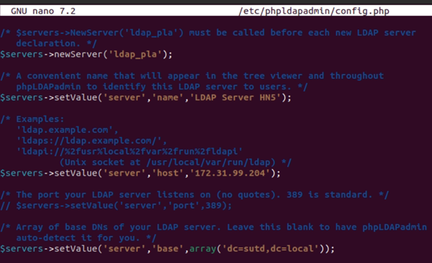
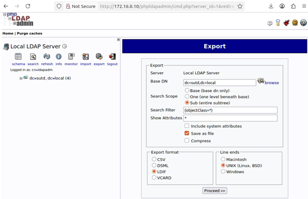
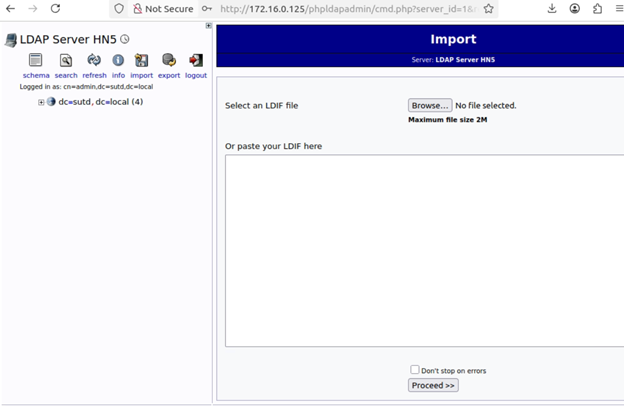

# Introduction

This guideline will help you to:

> ### 1. Install and configure the LDAP server on a new node  
> ### 2. Install and configure the phpLDAPadmin web interface on a new node  
> ### 3. Export LDAP data from an old node and import it to the new node  
> ### 4. Set up LDAP authentication for users

<br>
<br>
<br>

# Step 1 — Installing and Configuring the LDAP Server
> Successful installation in Sep 26th 2025

Ref: https://www.digitalocean.com/community/tutorials/how-to-install-and-configure-openldap-and-phpldapadmin-on-ubuntu-16-04

## Install the packages
```bash
sudo apt-get update
sudo apt-get install slapd ldap-utils
```
During the installation, you will be asked to select and confirm an administrator password for LDAP. You can enter anything here, because you’ll have the opportunity to update it in just a moment.
## Reconfigure **slapd** package
```bash
sudo dpkg-reconfigure slapd
```
> Omit OpenLDAP server configuration? **No**\
> DNS domain name? **Ex: sutd.local**\
> Organization name? **Ex: SUTD**\
> Administrator password? **Enter a secure password twice**\
> Database backend? **MDB**\
> Remove the database when slapd is purged? **No**\
> Move old database? **Yes**\
> Allow LDAPv2 protocol? **No**


## Open up the LDAP port on your firewall so external clients can connect
```bash
sudo ufw allow ldap
```

# Step 2 — Installing and Configuring the phpLDAPadmin Web Interface
```bash
sudo apt-get install phpldapadmin
```
- Configure the phpLDAPadmin Virtual Host Modify your configuration file located at /etc/apache2/conf-available/phpldapadmin.conf to look like the one below:
```bash
<Directory /usr/share/phpldapadmin/htdocs/>

    DirectoryIndex index.php
    Options +FollowSymLinks
    AllowOverride None
    Require all granted
    # limit libapache2-mod-php to the necessary files and directories

    # PHP 7
    <IfModule mod_php7.c>
        php_admin_value open_basedir /tmp:/usr/share/phpldapadmin/:/usr/share/doc/phpldapadmin:/etc/phpldapadmin/
    </IfModule>

    # PHP 8+
    <IfModule mod_php.c>
        php_admin_value open_basedir /tmp:/usr/share/phpldapadmin/:/usr/share/doc/phpldapadmin:/etc/phpldapadmin/
    </IfModule>

</Directory>

```
## Opening the main configuration file with root privileges in your text editor
```bash
sudo nano /etc/phpldapadmin/config.php
```

- Configure the phpLDAPadmin
```bash
sudo vi /etc/phpldapadmin/config.php
```

```bash
$servers->setValue('server','name','LDAP Server');
$servers->setValue('server','host','<Your host IP>');
$servers->setValue('login','bind_id','cn=ldapadm,dc=sutd,dc=local');
$servers->setValue('login','bind_pass','<Your pass>');
```
- Example



### Save your changes and exit the editor.
### Access http://<**Your host IP**>/phpldapadmin to ogging into the phpLDAPadmin Web Interface
  - Username: **cn=ldapadm,dc=sutd,dc=local** (Or **cn=admin,dc=sutd,dc=local**)
  - Password: **Your pass**

# Step 3 — Export LDAP from old NODE and Import to new NODE  
### **Export from old node**
- Login to phpLDAPadmin Web Interface of old node
- Select Export, tick options follow picture below 




### **Import to new node**
- Login to phpLDAPadmin Web Interface of new node
- Select Import, select file LDAP .ldif then click Proceed




- Verify LDAP import successfully (check uat user exist in Server)
```bash
sudo ldapsearch -x -D "cn=admin,dc=sutd,dc=local" -W   -b "ou=Users,dc=sutd,dc=local" "(uid=uat)"
```

```bash
# extended LDIF
#
# LDAPv3
# base <ou=Users,dc=sutd,dc=local> with scope subtree
# filter: (uid=uat)
# requesting: ALL
#

# uat user, Users, sutd.local
dn: cn=uat user,ou=Users,dc=sutd,dc=local
cn: uat user
gidNumber: 501
givenName: uat
homeDirectory: /home/users/uat
loginShell: /bin/bash
objectClass: inetOrgPerson
objectClass: posixAccount
objectClass: top
sn: user
uid: uat
uidNumber: 2002
userPassword:: e1NTSEF9dVlZTDA2TmR0ZEpXa0RRVTlyL1RDd3ozWTE3MCt4KzA=

# search result
search: 2
result: 0 Success

# numResponses: 2
# numEntries: 1
```
### **=> OK**

# Step 4 — Config LDAP Authentication

- Install requirements pakages
```bash
sudo apt update
sudo apt install libnss-ldap libpam-ldap ldap-utils nscd -y
```

- Open LDAP trong NSS.
```bash
sudo nano /etc/nsswitch.conf
```
- Find 3 lines and add **ldap**
```bash
passwd:         files ldap
group:          files ldap
shadow:         files ldap
```
- Enable LDAP authentication in PAM
```bash
sudo pam-auth-update
```
- Tick options
    - Unix authentication
    - LDAP Authentication
    - Create home directory on login

- Restart service
```bash
sudo systemctl restart nscd
```
- Check if LDAP user is recognized
```bash
getent passwd uat

uat:*:2002:501:uat user:/home/users/uat:/bin/bash

=> OK
```
### You can change User with command **su - \<user>**, and enter User password, this will automatically create User folder in /home/users/
