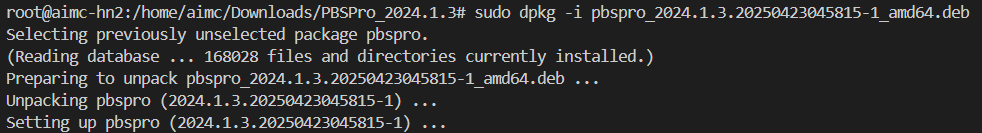
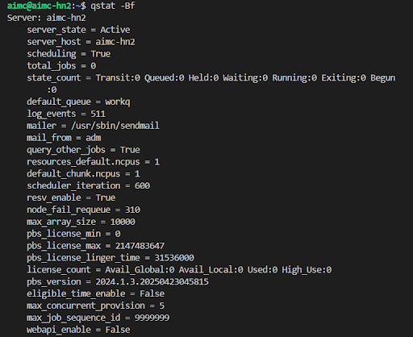
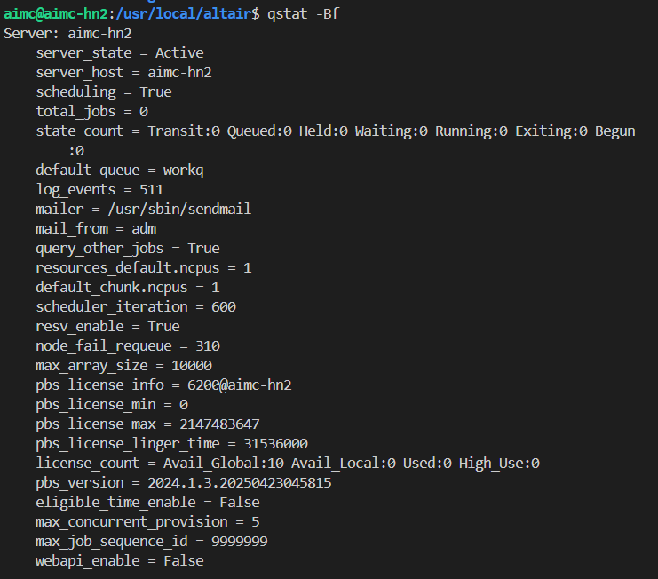
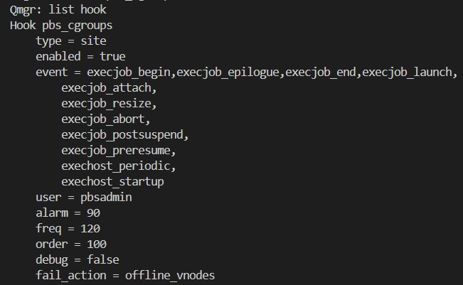
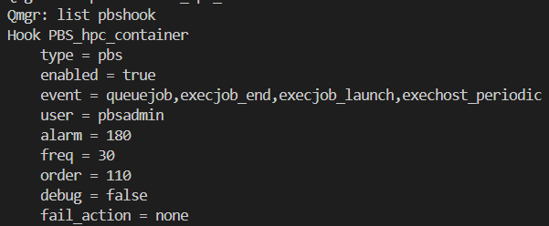
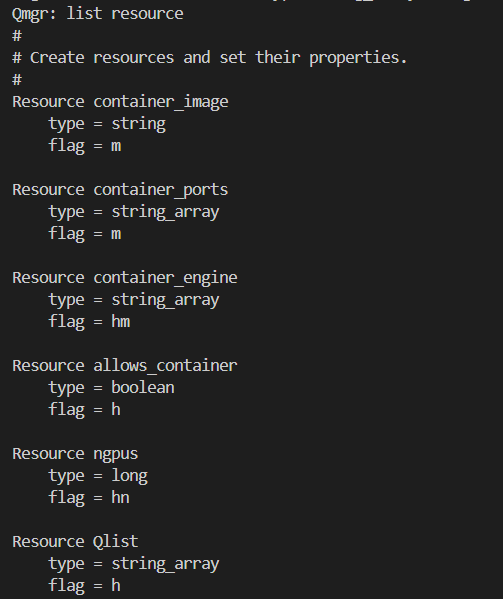
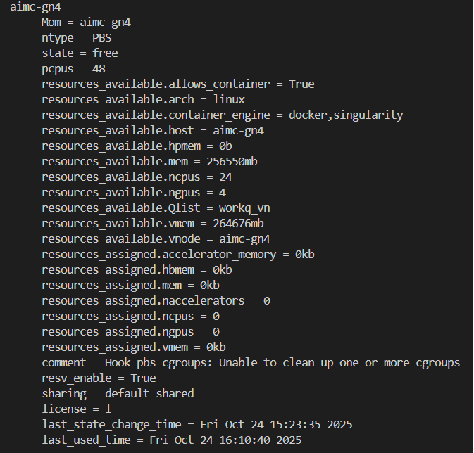
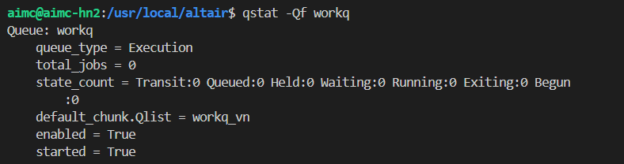

# Install PBS
---

## Install licensing
Install licensing on all hosts

### Install licensing
```bash
./altair_licensing_2025.0.linux_x64.bin
```

### Rename license file
```bash
Example:
mv altair_lic_2024.dat altair_lic.dat
```

### Copy license to license folder
Path: `/usr/local/altair/licensing2025.0`
```bash
cp altair_lic.dat /usr/local/altair/licensing2025.0
```

### Config
```bash
cd /usr/local/altair/licensing2025.0
nano altair-serv.cfg
```

Ex: If the Hostname and IP is: aimc-hn2 - 172.16.0.2 <br>
You can select 1 of 2 options:
```bash
HAL_SERVER1 = 6200@172.16.0.2
HAL_SERVER1 = 6200@aimc-hn2
```
Edit following fields:
```bash
HAL_SERVER1 = 6200@aimc-hn2
```

**NOTE**: The below config has to be same on license server

### Verify
```bash
cd /usr/local/altair/licensing2025.0/
./bin/almutil -licstat
```

### Log file
```bash
cd /usr/local/altair/licensing2025.0/logs/
```

### Restart
```bash
systemctl restart altairlmxd.service
```

## Add hostname and IP
```bash
sudo nano /etc/hosts
//add host
IP node
# PBS headnode cluster
172.18.0.10   aimc-hn1
172.18.0.2    aimc-hn2
172.18.0.3    aimc-hn3
172.18.0.4    aimc-hn4

#PBS compute node
172.18.0.13   aimc-gn1
172.18.0.14   aimc-gn2
172.18.0.19   aimc-gn3
172.18.0.20   aimc-gn4
172.18.0.31   aimc-gna1
172.18.0.32   aimc-gna2
172.18.0.23   aimc-h100-02
```

## Install
### Copy and extract installation file
### Install
- Install dependencies 
```
sudo apt install -y gcc make libtool libhwloc-dev libx11-dev \
    libxt-dev libedit-dev libical-dev ncurses-dev perl \
    postgresql-server-dev-all postgresql-contrib python3-dev tcl-dev tk-dev swig \
    libexpat-dev libssl-dev libxext-dev libxft-dev autoconf \
    automake g++ libcjson-dev
```
- Install PBS 
```bash
cd PBSPro_2024.1.3/
sudo dpkg -i pbspro_2024.1.3.20250423045815-1_amd64.deb
```

- if error occured, run below commands and rerun previous command
```
sudo groupadd tstgrp00
sudo useradd -r -g tstgrp00 pbsbuild
```


```bash
sudo dpkg -i pbspro-server_2024.1.3.20250423045815-1_amd64.deb
```
The result is:
```bash
Installation of PBS Professional

Terms of use for the software are available online at
http://www.pbspro.com/agreement.html

*** PBS Installation Summary
***
*** Postinstall script called as follows:
*** /opt/pbs/libexec/pbs_postinstall server 2022.1.1.20220926110806 /opt/pbs /var/spool/pbs pbsdata 
***
###########################################################
WARNING: Unable to find OpenSSL version 1.1.1, hence python's ssl module will not work
###########################################################
*** Existing configuration file found: /etc/pbs.conf
***
*** Saving /etc/pbs.conf as /etc/pbs.conf.pre.2022.1.1.20220926110806.20230406100613
*** Replacing /etc/pbs.conf with /etc/pbs.conf.2022.1.1.20220926110806
*** /etc/pbs.conf has been modified.
*** The original contents have been saved to /etc/pbs.conf.pre.2022.1.1.20220926110806.20230406100613
***
*** Registering PBS as a service.
***
*** PBS_HOME is /var/spool/pbs
*** Existing environment file left unmodified: /var/spool/pbs/pbs_environment
***
*** The PBS server has been installed in /opt/pbs/sbin.
*** The PBS scheduler has been installed in /opt/pbs/sbin.
***
*** The PBS communication agent has been installed in /opt/pbs/sbin.
***
*** The PBS MOM has been installed in /opt/pbs/sbin.
***
*** The PBS commands have been installed in /opt/pbs/bin.
***
*** End of /opt/pbs/libexec/pbs_postinstall
```
- `Install following packages if you need Headnode (Server) execute JOB`
```bash
Run command:
sudo dpkg -i pbspro-execution_2024.1.3.20250423045815-1_amd64.deb

=> Error when trying to install pbspro-server and pbspro-execution in parallel on the same node (server and compute).

Solution command:
sudo dpkg -i --force-overwrite pbspro-execution_2024.1.3.20250423045815-1_amd64.deb
```

```bash
Runn command:
sudo dpkg -i --force-overwrite pbspro-client_2024.1.3.20250423045815-1_amd64.deb
```

# Config Server node
```bash
sudo nano /etc/pbs.conf
```
On all nodes, PBS_SERVER= needs to point to the head node
On the head node, set these lines:
```bash
PBS_EXEC=/opt/pbs
PBS_SERVER=aimc-hn2
PBS_START_SERVER=1
PBS_START_SCHED=1
PBS_START_COMM=1
PBS_START_MOM=0
PBS_HOME=/var/spool/pbs
PBS_CORE_LIMIT=unlimited
PBS_SCP=/usr/bin/scp
```
- Next, one of the scripts errors with a syntax error. We have to fix that use ‘vim’ or ‘nano’ to open “/opt/pbs/libexec/pbs_db_utility” 
```
sudo nano /opt/pbs/libexec/pbs_db_utility

before: #!/bin/sh
after: #!/bin/bash
```

- Next we have to change the permissions of a couple of scripts so they work correctly

```
sudo chmod 4755 /opt/pbs/sbin/pbs_iff
sudo chmod 4755 /opt/pbs/sbin/pbs_rcp
```

Now we are ready to start up the server. Use the following command:
```bash
sudo systemctl enable pbs
sudo systemctl start pbs
sudo systemctl status pbs
```

Now check that the processes are running:
```bash
ps axf | grep pbs
```

On the server node, you should see
```bash
/opt/pbs/sbin/pbs_comm
/opt/pbs/sbin/pbs_sched
/opt/pbs/sbin/pbs_ds_monitor
/opt/pbs/sbin/pbs_server.bin
```

# Config License
Check License 
```bash
qstat -Bf
```


```bash
qmgr -c 'set server pbs_license_info=6200@aimc-hn2'
```



### Add resources Scheduler
#### Scheduler
```bash
sudo nano /var/spool/pbs/sched_priv/sched_config
```

```bash
resources: "ncpus, mem, arch, host, vnode, aoe, eoe, ngpus, Qlist, container_engine"
```

## Enable Hook
```bash
qmgr -c 'list hook'
qmgr -c 'set hook pbs_cgroups enabled = true'
```



```bash
qmgr -c 'set pbshook PBS_hpc_container enabled = true'
```


# Create resoure on server
```bash
qmgr -c 'create resource container_image type=string,flag=m'
qmgr -c 'create resource container_ports type=string_array,flag=m'
qmgr -c 'create resource container_engine type=string_array,flag=mh'
qmgr -c 'create resource allows_container type=boolean, flag=h'
qmgr -c 'create resource ngpus type=long, flag=nh'
qmgr -c 'create resource Qlist type=string_array, flag=h'
```




# Add Compute node
```bash
qmgr -c "create node aimc-gn3"
```
- Check node 
```bash
pbsnodes -a
```
- Delete node
```bash
qmgr -c "delete node aimc-gn3"
```

```bash
qmgr -c 's n aimc-gn3 resources_available.container_engine=docker'
qmgr -c 's n aimc-gn3 resources_available.container_engine+= singularity'
qmgr -c "s n aimc-gn3 resources_available.allows_container = true"
qmgr -c "s n aimc-gn3 resources_available.ngpus = 4"
qmgr -c "s n aimc-gn3 resources_available.Qlist = workq_vn"
qmgr -c "s n aimc-gn3 resources_available.Qlist += gold_vn"
```



## Check information queue workq
```bash
qstat -Qf workq

qmgr -c "s q workq default_chunk.Qlist = workq_vn"
```




#### cgroup
```bash
qmgr -c "list hook"

qmgr -c 'export hook pbs_cgroups application/x-config default' > pbs_cgroups.json
qmgr -c 'import hook pbs_cgroups application/x-config default pbs_cgroups.json'
qmgr -c 'set hook pbs_cgroups enabled = true'
```
```bash
    "cgroup_prefix"         : "pbs_jobs",
    "exclude_hosts"         : [],
    "exclude_vntypes"       : ["no_cgroups"],
    "run_only_on_hosts"     : [],
    "periodic_resc_update"  : true,
    "vnode_per_numa_node"   : false,
    "online_offlined_nodes" : true,
    "use_hyperthreads"      : false,
    "ncpus_are_cores"       : false,
    "discover_gpus"         : true,
    "manage_rlimit_as"      : true,
    "cgroup" : {
        "cpuacct" : {
            "enabled"            : true,
            "exclude_hosts"      : [],
            "exclude_vntypes"    : []
        },
        "cpuset" : {
            "enabled"            : true,
            "exclude_cpus"       : [],
            "exclude_hosts"      : [],
            "exclude_vntypes"    : [],
            "mem_fences"         : false,
            "mem_hardwall"       : false,
            "memory_spread_page" : false
        },
        "devices" : {
            "enabled"            : true,
            "exclude_hosts"      : [],
            "exclude_vntypes"    : [],
            "allow"              : [
                "b *:* rwm",
                "c *:* rwm"
            ]
        },
        "memory" : {
            "enabled"            : true,
            "exclude_hosts"      : [],
            "exclude_vntypes"    : [],
            "soft_limit"         : false,
            "enforce_default"    : true,
            "exclhost_ignore_default" : false,
            "default"            : "256MB",
            "reserve_percent"    : 0,
            "reserve_amount"     : "1GB"
        },
```

#### PBS_hpc_container
```bash
qmgr -c "export pbshook PBS_hpc_container application/x-config default" > container_config.json
qmgr -c "import pbshook PBS_hpc_container application/x-config default container_config.json"
qmgr -c 'set pbshook PBS_hpc_container enabled = true'
```

PBS_hpc_container config Docker
```bash
    "container_resource_name": "container_engine",
    "container_resource_default_value": "docker",
    "mount_paths": ["/etc/passwd", "/etc/group"],
    "mount_jobdir": true,
    "cred_base_path": "/home/users/",
    "allowed_registries": ["docker.io", "SylabsCloud", "PBS_ALL"],
    "docker":{
        "container_cmd": "/usr/bin/docker",
        "nvidia_docker_cmd": "/usr/bin/docker",
        "remove_env_keys": [],
        "port_ranges": [],
        "container_args_allowed": [],
        "enable_group_add_arg": false       
    },
```

# Create new Queue PBS
List information 
```bash
qstat -Qf
```
Create a new queue named "gold"
```bash
qmgr -c "create queue gold"
```
Set the queue type to Execution (an execution queue)
```bash
qmgr -c "set queue gold queue_type = Execution"
```

Limit the resources that can be queued (queued resources)
```bash
qmgr -c "set queue gold max_queued_res.ncpus = [u:PBS_GENERIC=40]"
qmgr -c "set queue gold max_queued_res.ngpus = [u:PBS_GENERIC=8]"
```
Enable ACL to control which users are allowed to submit jobs
```bash
qmgr -c "set queue gold acl_user_enable = True"
```
Add the list of users who are allowed to submit to the gold queue
```bash
qmgr -c "set queue gold acl_users += andy"
qmgr -c "set queue gold acl_users += bo_wang"
qmgr -c "set queue gold acl_users += bo_wang1"
qmgr -c "set queue gold acl_users += bo_wang2"
qmgr -c "set queue gold acl_users += chuang_zhang"
qmgr -c "set queue gold acl_users += guimeng_liu"
qmgr -c "set queue gold acl_users += nurul_akhira"
qmgr -c "set queue gold acl_users += sean_chenjiale"
qmgr -c "set queue gold acl_users += shengyu_zhang"
qmgr -c "set queue gold acl_users += tianze_yu"
qmgr -c "set queue gold acl_users += tomomasa_yamasaki"
qmgr -c "set queue gold acl_users += uat"
qmgr -c "set queue gold acl_users += username"
qmgr -c "set queue gold acl_users += vankhoa_duong"
qmgr -c "set queue gold acl_users += xiaofang_chen"
qmgr -c "set queue gold acl_users += zong_tianqi"
```

Set the maximum and default walltime (job runtime limit)
```bash
qmgr -c "set queue gold resources_max.walltime = 100:00:00"
qmgr -c "set queue gold resources_default.walltime = 24:00:00"
```
Associate the queue with the corresponding node or virtual node list
```bash
qmgr -c "set queue gold default_chunk.Qlist = gold_vn"
```
Limit the number of running jobs and running resources
```bash
qmgr -c "set queue gold max_run = [u:PBS_GENERIC=2]"
qmgr -c "set queue gold max_run_res.ncpus = [u:PBS_GENERIC=40]"
qmgr -c "set queue gold max_run_res.ngpus = [u:PBS_GENERIC=8]"
```

Enable and start the queue
```bash
qmgr -c "set queue gold enabled = True"
qmgr -c "set queue gold started = True"
```

Add node to queue
```bash
qmgr -c "s n aimc-gn3 resources_available.Qlist += gold_vn"
qmgr -c "s n aimc-gn4 resources_available.Qlist += gold_vn"
```


# Add user to queue
```bash
sudo su
qmgr
s q gold acl_users +='zihan_chen'
```
