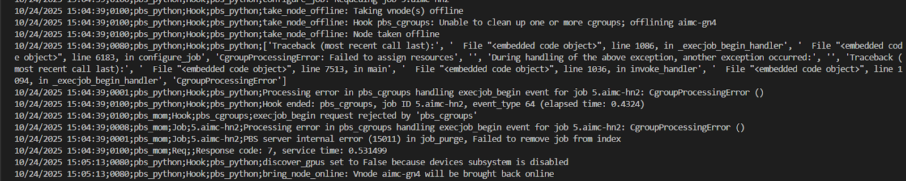
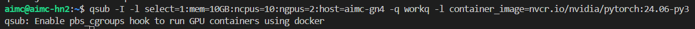
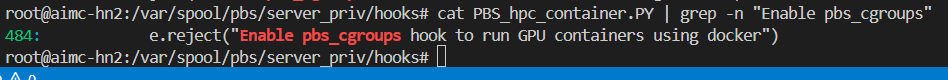
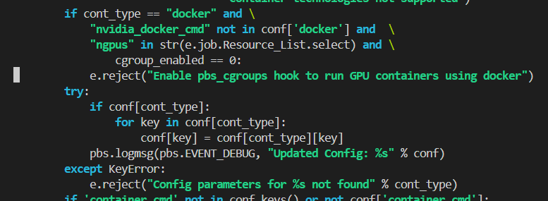
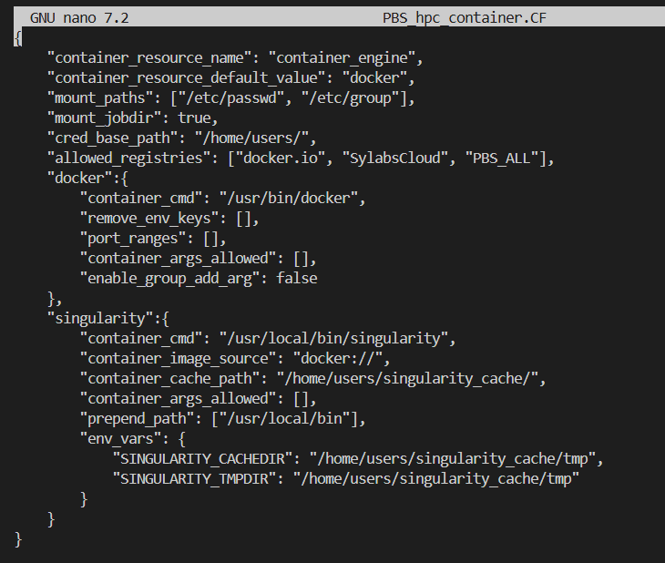
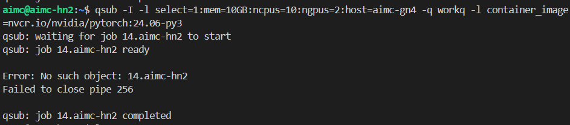
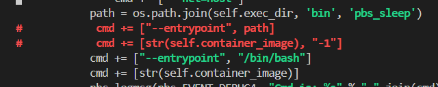
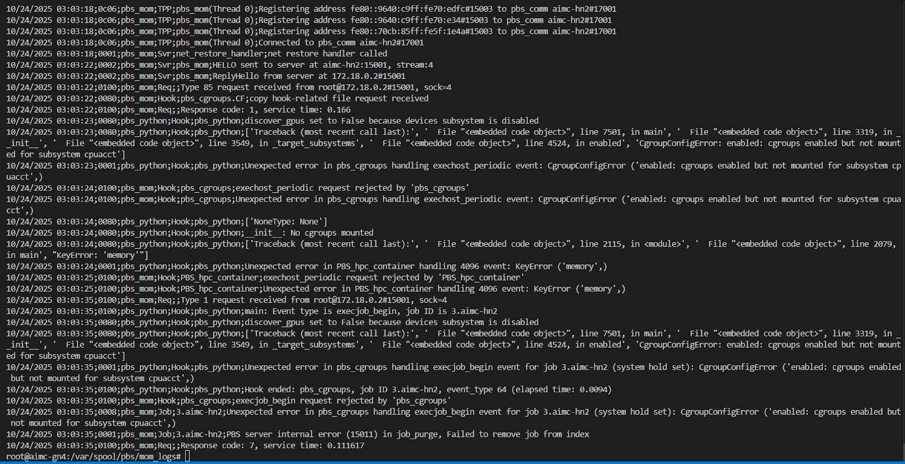
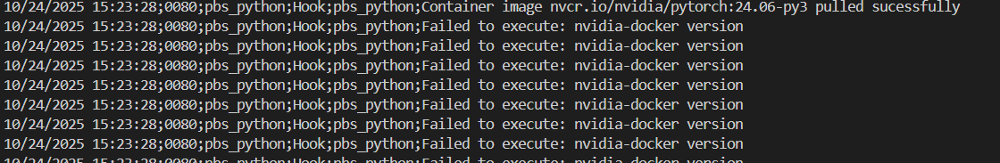
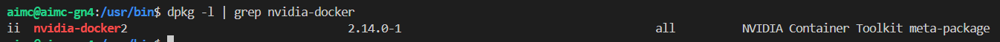

# `HEAD NODE`

## `Headnode: CgroupProcessingError: Failed to assign resources`


- Solution: Fix on headnode
```bash
sudo nano pbs_cgroups.CF
```

- Change enabled: false -> true

```bash
        "devices" : {
            "enabled"            : true,
            "exclude_hosts"      : [],
            "exclude_vntypes"    : [],
            "allow"              : [
                "b *:* rwm",
                "c *:* rwm"
            ]
        },
```

- Then restart PBS
```bash
sudo systemctl stop pbs
sudo systemctl enable pbs
sudo systemctl start pbs
sudo systemctl status pbs
```

## `Headnode error: Enable pbs_cgroups hook to run GPU containers using docker`

```bash
cat PBS_hpc_container.PY | grep -n "Enable pbs_cgroups"
```






> missing nvidia_docker_cmd attribute

> solution: Fix on headnode, add "nvidia_docker_cmd": "/usr/bin/docker",

- Then restart PBS
```bash
sudo /etc/init.d/pbs restart
```

## `Headnode Error: No such object:`


- Solution:
```bash
sudo nano PBS_hpc_container.PY
```

- Go to line 1924 and edit like this:


```
cmd += ["--entrypoint", "/bin/bash"]
cmd += [str(self.container_image), "-l"]
```

## `Headnode: Fix submit from login node`
```
qmgr -c "set server flatuid = true”
```

# `COMPUTE NODE`
## `Compute node: Error cgroups v2`
### Reason: Compute node is running cgroupsv2, but PBSpro required to use cgroupsv1



```bash
10/24/2025 03:03:23;0080;pbs_python;Hook;pbs_python;['Traceback (most recent call last):', '  File "<embedded code object>", line 7501, in main', '  File "<embedded code object>", line 3319, in __init__', '  File "<embedded code object>", line 3549, in _target_subsystems', '  File "<embedded code object>", line 4524, in enabled', 'CgroupConfigError: enabled: cgroups enabled but not mounted for subsystem cpuacct']

10/24/2025 03:03:23;0001;pbs_python;Hook;pbs_python;Unexpected error in pbs_cgroups handling exechost_periodic event: CgroupConfigError ('enabled: cgroups enabled but not mounted for subsystem cpuacct',)

10/24/2025 03:03:24;0100;pbs_mom;Hook;pbs_cgroups;exechost_periodic request rejected by 'pbs_cgroups'

10/24/2025 03:03:24;0100;pbs_mom;Hook;pbs_cgroups;Unexpected error in pbs_cgroups handling exechost_periodic event: CgroupConfigError ('enabled: cgroups enabled but not mounted for subsystem cpuacct',)

10/24/2025 03:03:24;0080;pbs_python;Hook;pbs_python;['NoneType: None']

10/24/2025 03:03:24;0080;pbs_python;Hook;pbs_python;__init__: No cgroups mounted

10/24/2025 03:03:24;0080;pbs_python;Hook;pbs_python;['Traceback (most recent call last):', '  File "<embedded code object>", line 2115, in <module>', '  File "<embedded code object>", line 2079, in main', "KeyError: 'memory'"]

10/24/2025 03:03:24;0001;pbs_python;Hook;pbs_python;Unexpected error in PBS_hpc_container handling 4096 event: KeyError ('memory',)

10/24/2025 03:03:25;0100;pbs_mom;Hook;PBS_hpc_container;exechost_periodic request rejected by 'PBS_hpc_container'

10/24/2025 03:03:25;0100;pbs_mom;Hook;PBS_hpc_container;Unexpected error in PBS_hpc_container handling 4096 event: KeyError ('memory',)

10/24/2025 03:03:35;0100;pbs_mom;Req;;Type 1 request received from root@172.18.0.2#15001, sock=4

10/24/2025 03:03:35;0100;pbs_python;Hook;pbs_python;main: Event type is execjob_begin, job ID is 3.aimc-hn2

10/24/2025 03:03:35;0080;pbs_python;Hook;pbs_python;discover_gpus set to False because devices subsystem is disabled

10/24/2025 03:03:35;0080;pbs_python;Hook;pbs_python;['Traceback (most recent call last):', '  File "<embedded code object>", line 7501, in main', '  File "<embedded code object>", line 3319, in __init__', '  File "<embedded code object>", line 3549, in _target_subsystems', '  File "<embedded code object>", line 4524, in enabled', 'CgroupConfigError: enabled: cgroups enabled but not mounted for subsystem cpuacct']

10/24/2025 03:03:35;0001;pbs_python;Hook;pbs_python;Unexpected error in pbs_cgroups handling execjob_begin event for job 3.aimc-hn2 (system hold set): CgroupConfigError ('enabled: cgroups enabled but not mounted for subsystem cpuacct',)

10/24/2025 03:03:35;0100;pbs_python;Hook;pbs_python;Hook ended: pbs_cgroups, job ID 3.aimc-hn2, event_type 64 (elapsed time: 0.0094)

10/24/2025 03:03:35;0100;pbs_mom;Hook;pbs_cgroups;execjob_begin request rejected by 'pbs_cgroups'

10/24/2025 03:03:35;0008;pbs_mom;Job;3.aimc-hn2;Unexpected error in pbs_cgroups handling execjob_begin event for job 3.aimc-hn2 (system hold set): CgroupConfigError ('enabled: cgroups enabled but not mounted for subsystem cpuacct',)

10/24/2025 03:03:35;0001;pbs_mom;Job;3.aimc-hn2;PBS server internal error (15011) in job_purge, Failed to remove job from index

10/24/2025 03:03:35;0100;pbs_mom;Req;;Response code: 7, service time: 0.111617
```

- Identify the cgroup version on Linux Nodes
```bash
stat -fc %T /sys/fs/cgroup/
```

- For cgroup v2, the output is cgroup2fs.

- For cgroup v1, the output is tmpfs.

## => Solution: Fix on compute node, down to cgroup v1

## `Compute node Error Failed to execute: nvidia-docker version`
### Reason: nvidia-docker not longer exist



### Solution: Fix on compute node, create Wrapper for nvidia-docker, avoid to modified PBS_hpc_container.PY

- Check version nvidia-docker

```bash
dpkg -l | grep nvidia-docker
```


- Run command:
```bash
sudo tee /usr/bin/nvidia-docker > /dev/null <<'EOF'
#!/bin/bash
if [[ "$1" == "version" ]]; then
  echo "NVIDIA Docker: 2.14.0"
  docker version
  exit 0
else
  exec docker --runtime=nvidia "$@"
fi
EOF
sudo chmod +x /usr/bin/nvidia-docker
```

- Then restart PBS
```bash
sudo /etc/init.d/pbs restart
```

## `Compute node: Error Cannot use nvidia-smi in container`
- Reason: Default runtime not set
```
sudo nano /etc/docker/daemon.json
```
Add   "default-runtime": "nvidia" like this
```
{
  "runtimes": {
    "nvidia": {
      "path": "nvidia-container-runtime",
      "runtimeArgs": []
    }
  },
  "default-runtime": "nvidia"
}
```
Reload docker
```
sudo systemctl daemon-reload
sudo systemctl restart docker
```
Verify changed command: 
```
docker info | grep -A3 Runtime
```

Test docker 
```
qsub -I -l select=1:mem=10GB:ncpus=10:ngpus=2:host=aimc-gn3 -q workq -l container_image=nvcr.io/nvidia/pytorch:24.06-py3
```

Run command:
```
nvidia-smi
```

## `Compute node: Set docker shared memory`
```bash
sudo nano /etc/docker/daemon.json
```

```bash
    "default-shm-size": "256G",
    "default-ulimits": {
             "memlock": { "name":"memlock", "soft":  -1, "hard": -1 },
             "stack"  : { "name":"stack", "soft": 67108864, "hard": 67108864 }
    } 
```

- Restart docker
```
sudo systemctl daemon-reload
sudo systemctl restart docker
```

- Test docker 
```bash
docker run --gpus all -it nvcr.io/nvidia/pytorch:24.06-py3 bash
```

## `Compute node: Fix authentication: I have no name:`
- This script will add user from LDAP to /etc/passwd and /etc/group
- Edit location backup file - BACKUP_DIR
```
cd /adm/hpc/auto-script
nano ./append_passwd_group.sh
```

- Run script
```
./append_passwd_group.sh
```
- Restart PBS
```
sudo systemctl restart pbs
sudo systemctl status pbs
```