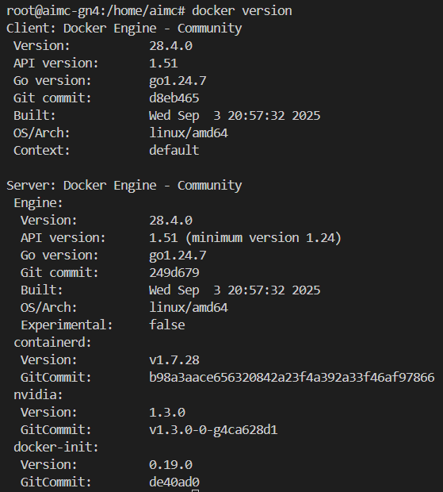
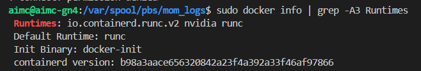
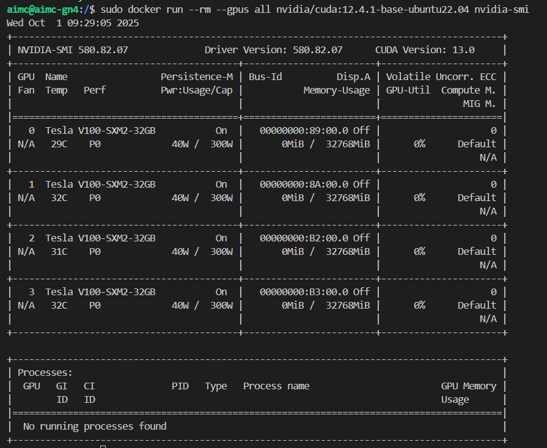
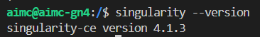
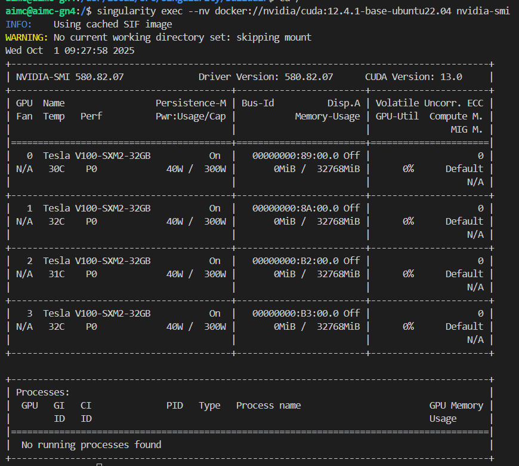

# Install Driver Network 100Gb Ubuntu 24.04
- Run command
```
wget https://content.mellanox.com/ofed/MLNX_OFED-24.10-3.2.5.0/MLNX_OFED_LINUX-24.10-3.2.5.0-ubuntu24.04-x86_64.iso

mount -o ro,loop ./MLNX_OFED_LINUX-5.4-3.6.8.1-ubuntu22.04-x86_64.iso /mnt

cd /mnt

./mlnxofedinstall --force

/etc/init.d/openibd restart

ofed_info -s
```

# Install Nvidia driver 580.82.07 
- Download package
```
wget https://us.download.nvidia.com/tesla/580.82.07/nvidia-driver-local-repo-ubuntu2404-580.82.07_1.0-1_amd64.deb

sudo dpkg -i nvidia-driver-local-repo-ubuntu2404-580.82.07_1.0-1_amd64.deb

sudo cp /var/nvidia-driver-local-repo-ubuntu2404-580.82.07/nvidia-driver-local-* /usr/share/keyrings/
```
- Install driver NVIDIA
```
sudo apt-get update
sudo apt-get install -y nvidia-driver-580
sudo reboot
```
Check driver NVIDIA
```
nvidia-smi
```

- Uninstall 
```
sudo apt-get purge '^nvidia-.*'
sudo rm /etc/apt/sources.list.d/nvidia-driver-local-repo-ubuntu2404-580.82.07.list
sudo rm /usr/share/keyrings/nvidia-driver-local-*.gpg
sudo apt-get update
sudo reboot
```

# Install docker (version 28.4.0) on Ubuntu 24.04
- Uninstall old Docker (if any)
```
sudo apt-get remove -y docker docker-engine docker.io containerd runc
```

- Install Docker Engine (latest)
```
sudo apt-get update
sudo apt-get install -y ca-certificates curl gnupg lsb-release
```

- Add GPG key:
```
sudo mkdir -p /etc/apt/keyrings
curl -fsSL https://download.docker.com/linux/ubuntu/gpg | sudo gpg --dearmor -o /etc/apt/keyrings/docker.gpg
```


- Add repo:
```
echo \
  "deb [arch=$(dpkg --print-architecture) signed-by=/etc/apt/keyrings/docker.gpg] \
  https://download.docker.com/linux/ubuntu \
  $(lsb_release -cs) stable" | sudo tee /etc/apt/sources.list.d/docker.list > /dev/null
```

- Install Docker:
```
sudo apt-get update
sudo apt-get install -y docker-ce docker-ce-cli containerd.io docker-buildx-plugin docker-compose-plugin
```

Check docker with command:
```
docker version
```



# Install NVIDIA Container Toolkit
- To make Docker recognize the GPU:
```
curl -fsSL https://nvidia.github.io/libnvidia-container/gpgkey | sudo gpg --dearmor -o /usr/share/keyrings/nvidia-container-toolkit-keyring.gpg
curl -s -L https://nvidia.github.io/libnvidia-container/stable/deb/nvidia-container-toolkit.list | \
  sed 's#deb https://#deb [signed-by=/usr/share/keyrings/nvidia-container-toolkit-keyring.gpg] https://#g' | \
  sudo tee /etc/apt/sources.list.d/nvidia-container-toolkit.list
```

- Run install command:
```
sudo apt-get update
sudo apt-get install -y nvidia-container-toolkit
```
## Configure Docker to use GPU runtime
- Run commands:
```
sudo nvidia-ctk runtime configure --runtime=docker
sudo systemctl restart docker
```

- Verify docker runtime 
```
sudo docker info | grep -A3 Runtimes
```
✅ If there is a line “Runtimes: nvidia” is correct.



- Test container docker with image and GPU
```
sudo docker run -it --rm --gpus all nvidia/cuda:12.4.1-base-ubuntu22.04 nvidia-smi
```



# Install singularity runtime 

## Installing Singularity
### On Ubuntu 24.04, it’s recommended to use the latest version:

- Step 1: Install dependencies
```
sudo apt update
sudo apt install -y build-essential libseccomp-dev pkg-config squashfs-tools cryptsetup libglib2.0-dev libfuse2 libfuse3-dev pkg-config autoconf automake libtool
```

- Step 2: Install Go (required to build Singularity)
```
sudo apt install -y golang-go
```

- Check version:
```
go version
```
> You need >= 1.20 (Ubuntu 24.04 already provides 1.22 )

- Step 3: Download SingularityCE source code
```
cd /usr/local/src
sudo git clone https://github.com/sylabs/singularity.git
cd singularity
sudo git checkout v4.1.3
```

> If you get a missing submodules error:
```
cd /usr/local/src/singularity
sudo git submodule update --init --recursive
```

- Step 4: Build Singularity
```
cd /usr/local/src/singularity
sudo ./mconfig
cd builddir
sudo make -j$(nproc)
sudo make install
```

- After installation, check:
```
singularity --version
```



- Step 5: Test GPU with Singularity
> Singularity supports GPUs if the node has NVIDIA drivers + CUDA installed. Run the following test:
```
singularity exec --nv docker://nvidia/cuda:12.4.1-base-ubuntu22.04 nvidia-smi
```




# Install Enroot
## Step 1: Check prerequisites before installation
> On the node you want to install Enroot (or on all compute nodes):
```
uname -r        # Check kernel version (>= 4.0)
which curl
which gpg
```
- If any of these are missing:
```
sudo apt update
sudo apt install -y curl gpg squashfs-tools fuse3
```

## Step 2: Install Enroot (Ubuntu 24.04)
> NVIDIA provides the official repository:
```
curl -fSsL -O https://github.com/NVIDIA/enroot/releases/download/v3.5.0/enroot_3.5.0-1_amd64.deb
curl -fSsL -O https://github.com/NVIDIA/enroot/releases/download/v3.5.0/enroot+caps_3.5.0-1_amd64.deb
```

- Then install:
```
sudo apt install -y ./enroot_3.5.0-1_amd64.deb ./enroot+caps_3.5.0-1_amd64.deb
```

- Check version:
```
enroot version
```

## Step 3: Config to use enroot
- Enable user to use enroot
```
sudo mkdir -p /run/enroot
sudo chown root:root /run/enroot
sudo chmod 755 /run/enroot
```
- Create enroot folder
```
mkdir -p /raid/enroot_folder
chown root:root /raid/enroot_folder
sudo chmod 1777 /raid/enroot_folder
```

- Enable using GPU on enroot container
```
echo "NVIDIA_DRIVER_CAPABILITIES=compute,utility" >> /etc/environment
echo "NVIDIA_VISIBLE_DEVICES=all" >> /etc/environment
```

## Step 4: Test Enroot on the node
- Import an Ubuntu image:
```
enroot import docker://ubuntu:22.04
```

- Then create and run the container:
```
enroot create ubuntu+22.04.sqsh
```


# Install Environment module
- Install lua package:
```
sudo apt update
sudo apt install -y lua5.3 liblua5.3-dev tcl tcl-dev pkg-config build-essential
sudo apt install -y lua-posix lua-filesystem
```

```
cd /mnt/beegfs/app
wget https://github.com/TACC/Lmod/archive/refs/tags/8.7.23.tar.gz
tar xvf 8.7.23.tar.gz
cd Lmod-8.7.23
```

- Install Lmod:
```
./configure   --prefix=/mnt/beegfs/app/lmod   --with-lua=/usr/bin/lua5.3   --with-luac=/usr/bin/luac5.3
make -j$(nproc)
make pre-install
```

- Create symlink:
```
sudo ln -sf /mnt/beegfs/app/lmod/lmod/8.7.23/init/profile /etc/profile.d/z00_lmod.sh
sudo ln -sf /mnt/beegfs/app/lmod/lmod/8.7.23/init/cshrc /etc/profile.d/z00_lmod.csh
```

- Update shell
```
source /etc/profile.d/z00_lmod.sh
```

- Verify Lmod:
```
module --version
module avail
```

# LDAP H100
- Check old LDAP
```
cat /etc/nslcd.conf
```

- Disable LDAP old
```
systemctl status nslcd
systemctl status slapd
```
```
systemctl stop nslcd
systemctl disable nslcd
```
```
systemctl stop slapd
systemctl disable slapd
```
- Remove sss and ldap in /etc/nsswitch.conf file
- Verify:
```
grep -E "sss|ldap" /etc/nsswitch.conf
grep -rl "pam_ldap" /etc/pam.d | while read f; do sed -i '/pam_ldap/d' "$f"; done
sed -i '/pam_mkhomedir.so/d' /etc/pam.d/common-session || true
```
- Run script join-trinity-ldap.sh
```
cd /adm/hpc/auto-script
./join-trinity-ldap.sh
```


# Install Nvidia-Fabric
- Download install file
```
wget https://developer.download.nvidia.com/compute/cuda/repos/ubuntu2404/x86_64/nvidia-fabricmanager_580.95.05-1_amd64.deb
```
- Run install 
```
sudo apt install ./nvidia-fabricmanager_580.95.05-1_amd64.deb
```
- Enable service
```
sudo systemctl enable --now nvidia-fabricmanager
systemctl status nvidia-fabricmanager
```


# Setup local registry on AIMC-HN4
## 1. Install Docker Engine (Ubuntu 24.04)
```
sudo apt update
sudo apt install -y ca-certificates curl gnupg lsb-release
```

- Install required system packages for Docker and secure repositories.
```
sudo mkdir -p /etc/apt/keyrings
curl -fsSL https://download.docker.com/linux/ubuntu/gpg | sudo gpg --dearmor -o /etc/apt/keyrings/docker.gpg
```

- Add Docker’s official GPG key to verify Docker packages.
```
echo "deb [arch=$(dpkg --print-architecture) signed-by=/etc/apt/keyrings/docker.gpg] https://download.docker.com/linux/ubuntu noble stable" \
| sudo tee /etc/apt/sources.list.d/docker.list
```

-Add the official Docker APT repository for Ubuntu 24.04 (noble), install Docker Engine and related tools.
```
sudo apt update
sudo apt install -y docker-ce docker-ce-cli containerd.io docker-buildx-plugin docker-compose-plugin
```

- Start Docker and verify the installation.
```
sudo systemctl enable docker
sudo systemctl start docker
docker version
```
## 2. Configure hostnames for the local registry
```
sudo nano /etc/hosts
192.168.33.4 aimc.registry
192.168.33.4 hub.aimc.local
```
## 3. Allow insecure (HTTP) local registry
- Allow Docker to communicate with an internal HTTP registry (no TLS).
```
sudo vi /etc/docker/daemon.json

{
  "insecure-registries": [
    "aimc.registry:5000",
    "hub.aimc.local:5000"
  ]
}
```

- Apply Docker daemon configuration changes.
```
sudo systemctl restart docker
```
## 4. Run the Docker Registry server
- Create a persistent storage directory for registry images.
```
sudo mkdir -p /mnt/data/local-registry
```

- Start a local Docker Registry container on port 5000.
```
sudo docker run -d \
  -p 5000:5000 \
  --restart=always \
  --name registry \
  -v /mnt/data/local-registry:/var/lib/registry \
  registry:2.7.0
```
- Verify that the registry container is running.
```
docker ps
```
## 5. Push an image to the local registry
- Pull an image from Docker Hub.
```
docker pull ubuntu:22.04
```

- Retag the image for the local registry.
```
docker tag ubuntu:22.04 aimc.registry:5000/ubuntu:22.04
```

- Push the image into the internal registry.
```
docker push aimc.registry:5000/ubuntu:22.04
```
## 6. Configure compute nodes to use the registry
- Ensure compute nodes can resolve the registry hostname.
```
nano /etc/hosts
192.168.33.4 aimc.registry
192.168.33.4 hub.aimc.local
```

- Allow Docker on compute nodes to access the internal registry.
```
sudo nano /etc/docker/daemon.json

{
  "insecure-registries": [
    "aimc.registry:5000",
    "hub.aimc.local:5000"
  ]
}
```
- Apply Docker configuration on compute nodes.
```
sudo systemctl restart docker
```
## 7. Verify registry access from compute nodes
- Pull the image from the local registry (LAN, no Internet).
```
docker pull aimc.registry:5000/ubuntu:22.04
```

- Confirm Docker recognizes the internal registry configuration.
```
docker info | grep -A5 -i registry
```

- Check image and tag on registry:
```
curl http://192.168.33.4:5000/v2/_catalog
curl http://192.168.33.4:5000/v2/ai-container/tags/list
```